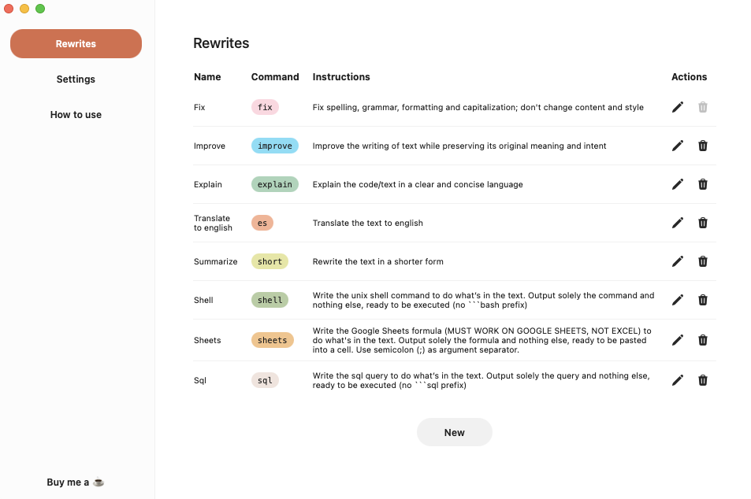
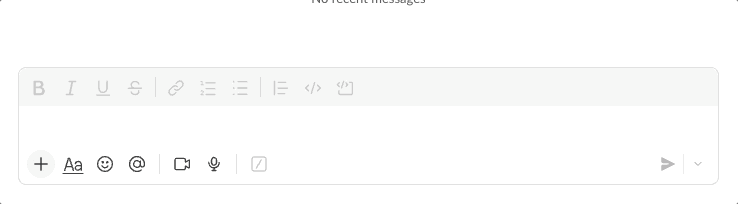

# Reright

  

  <strong>Transform your text with AI, right from your clipboard.</strong>

  
  

  

---

You shouldn't have to break your flow to alt-tab to ChatGPT for every small adjustment. **Reright** lives quietly in your system tray, turning your clipboard into a universal AI command palette. Copy text, trigger a global shortcut, and paste the result back without ever leaving the app you’re in.

Reright works in the high-frequency spots where you spend your day:

* **Slack & email**: Rescue your typo-ridden brain-dump Slack messages, shift tones, or turn intent into a full email in seconds.
* **Terminal & code**: Generate shell one-liners, SQL queries, regexes, or quick code snippets from a simple description.
* **Figma**: Generate instant microcopy for buttons, empty states, and error messages.
* **GitHub**: Transform rough notes into crisp, respectful PR review comments.
* **Notion & Docs**: Structure messy thoughts, translate content, and fix grammar instantly.

AI features are everywhere (Grammarly, Notion, etc.) and they all want a subscription. Skip the subscription with Reright: bring your own API key (OpenAI, Anthropic, or Gemini) and pay only for what you use, keeping costs minimal.

## Download

**macOS:** [Download the latest release](https://github.com/jmacedoit/reright/releases/latest)

> Support for other platforms is under consideration. Show your interest by starring the repo and [supporting me](https://buymeacoffee.com/jmacedo).

## Preview

  

## How It Works

Reright helps you transform text using AI-powered rewrites. Copy any text, trigger a rewrite, and paste the result. Here's how each mode works:

### Mode 1: Quick Rewrite (Default Command)

The fastest way to transform text using your default rewrite command.

1. **Select and copy** the text you want to rewrite
2. Press your configured **global shortcut** to trigger the rewrite
3. **Paste** the transformed text

**Example** (using a "fix" command):

| Before | After |
|--------|-------|
| `teh quick browm fox jumpd over the lazzy dog` | `The quick brown fox jumped over the lazy dog.` |

  

### Mode 2: Command-Specific Rewrite

Append a command word after `///` to use a specific rewrite instead of the default.

1. **Write** your text, add `///`, then the command word
2. **Copy** the entire text (including the command) and press your shortcut
3. **Paste** the enhanced result

**Example** (using an "enhance" command):

| Before | After |
|--------|-------|
| `The quarterly results were good///enhance` | `The quarterly results demonstrated exceptional performance, exceeding projected targets across all key metrics.` |

> Available commands depend on your configured rewrites. Check the **Rewrites** tab in the app to see all available command words.

  

### Mode 3: Ad-hoc Instructions

Provide custom, one-time instructions after `///` for complete flexibility.

1. **Write** your text, add `///`, then your custom instructions
2. **Copy** everything and press your shortcut
3. **Paste** the customized result

**Example:**

| Before | After |
|--------|-------|
| `Hello John, I wanted to follow up on our meeting///make this more formal and add a request for scheduling a call` | `Dear Mr. John, I hope this message finds you well. I am writing to follow up on our recent meeting. I would greatly appreciate the opportunity to schedule a call at your earliest convenience to discuss the next steps. Best regards` |

> Ad-hoc instructions are detected when your text after `///` doesn't match any existing command word.

  

### 💡 Tip

Instead of using the keyboard shortcut, you can also trigger rewrites from the **tray menu** in your system bar. This gives you quick access to all your configured rewrites and works the same way—just select your text, copy it, choose a rewrite from the tray menu, and paste the result.

## Features

- 🎯 **System tray integration**: Always accessible, never in the way
- ⌨️ **Global keyboard shortcuts**: Transform text without leaving your current app
- 🔧 **Custom rewrite commands**: Create your own transformations (fix, enhance, translate, etc.)
- 💬 **Ad-hoc instructions**: One-time custom prompts when you need flexibility
- 🤖 **Multiple AI providers**: Works with OpenAI, Anthropic (Claude), and Google (Gemini)
- 🚀 **Fast & lightweight**: Built with Tauri for native performance

## Contributing

Contributions are welcome! Please see [CONTRIBUTING.md](CONTRIBUTING.md) for detailed guidelines on how to get started.

## License

This project is licensed under the **Source-Available Non-Commercial License (SANCL)**. See [LICENSE.txt](LICENSE.txt) for details.

In short:

- ✅ Free for personal and non-commercial use
- ✅ Modify for personal use
- ❌ Commercial use not permitted
- ❌ Selling or commercial distribution not permitted
